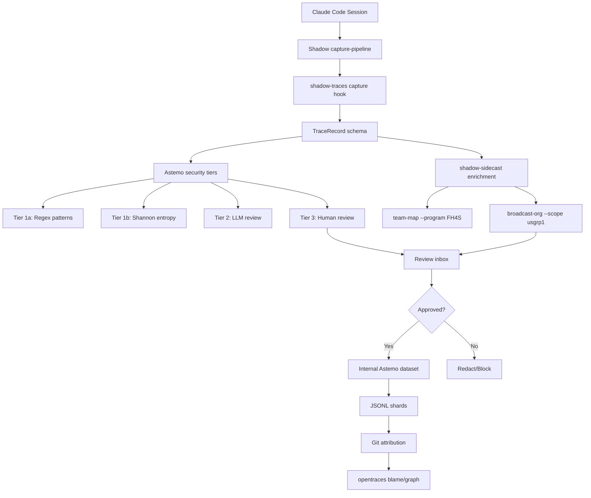

# shadow-traces — Shadow Agent Trace Capture System

## Purpose

Bridge Shadow's 7-stage capture pipeline with agent trace capture for Astemo enterprises. Capture Claude Code sessions, apply Astemo security rules, enrich with program/org context, publish to internal Astemo dataset.

## Architecture



**Data flow:**
1. Claude Code session captured via Shadow pipeline
2. Parsed into TraceRecord schema
3. Security scanning (Astemo-specific rules)
4. Enriched with shadow-sidecast org data
5. Human review (Tier 3)
6. Publish to internal Astemo dataset
7. Git attribution links traces to commits

## Prerequisites

- Load **astemo-context** for program mapping
- Load **shadow-sidecast** for org data
- Install opentraces CLI: `pipx install opentraces` (or from source)

## Key Concepts

### Shadow → Trace Mapping

| Shadow Stage | Trace Field | Source |
|--------------|-------------|--------|
| source_app | agent.name | app-catalog.json |
| source_id | session_id | capture session UUID |
| extractor_profile | capture_method | browser-dom-capture, file-read |
| normalizer_profile | task.description | enterprise-distill |
| provenance | task.metadata | capture metadata |
| promotion_path | lifecycle | memory_topology routing |

### Astemo Security Tiers

Override default tiers with Astemo enterprise rules:

| Tier | Name | Astemo Rules | Status |
|------|------|--------------|--------|
| 1a | Regex patterns | Add Astemo secret patterns (M365, SharePoint, Smartsheet tokens) | Always on |
| 1b | Shannon entropy | Threshold: 4.5 for API keys, 3.8 for internal tokens | Always on |
| 1.5 | TruffleHog | Skip internal Astemo domains (astemo.com, hitachigroup.sharepoint.com) | Optional |
| 2 | LLM trace review | Prompt: "Check for Astemo confidential info, Honda/FCA customer data, supplier quotes" | On demand |
| 3 | Human review | Required for traces containing: customer names, part numbers, supplier quotes | Always available |

### shadow-sidecast Enrichment

Parse shadow-sidecast output and add to `task.metadata`:

```python
# From: shadow-sidecast team-map --program FH4S
{
  "us_team": ["Sabarish Duvvuru", "Kevin Butler", "Bryan Voris"],
  "jp_team": ["Iwata Naoki", "Hosoya Haruyasu", "Sakamoto Kenichi"],
  "cross_functional": {
    "SQ": "Emily Howard",
    "PE": "Hosoya Haruyasu",
    "BUP": "Lisa Matsuda",
    "PMO": "Miki Cross"
  },
  "meeting_cadence": "Tuesday 3:30pm (US-JP weekly)"
}

# From: shadow-sidecast broadcast-org --scope usgrp1
{
  "reporting_lines": [
    {"from": "Sabarish Duvvuru", "to": "Kevin Butler", "relationship": "reports_to"},
    {"from": "IPM Team", "to": "Sabarish Duvvuru", "relationship": "led_by"}
  ]
}
```

## Installation

### 1. Install opentraces CLI

```bash
# Preferred (end-user)
pipx install opentraces

# Or from source (dev)
git clone https://github.com/JayFarei/opentraces.git
cd opentraces
python3 -m venv .venv
source .venv/bin/activate
pip install -e packages/opentraces-schema
pip install -e ".[dev]"
```

### 2. One-time machine setup

```bash
# Install capture hooks, watcher, HF login (or internal Astemo dataset)
opentraces setup

# Configure Astemo security tiers
shadow-traces configure --security-tiers astemo

# Install post-commit correlator (git attribution)
opentraces setup git
```

### 3. Initialize repo

```bash
cd /path/to/project
opentraces init
# Follow prompts for agents (Claude Code), review policy, remote dataset
```

## Workflow

### Daily Capture

```bash
# Check capture status
opentraces status

# Review traces in web UI
opentraces web
# or: opentraces tui

# Stage reviewed traces
opentraces add --all

# Push to internal Astemo dataset
opentraces push
```

### Shadow-Traces Commands

```bash
# Enrich trace with shadow-sidecast data
shadow-sidecast team-map --program FH4S | shadow-traces enrich --stdin

# Check for customer data (Honda, FCA)
shadow-traces audit --customer-data --trace <trace-id>

# Export trace for program review (FH4S weekly)
trace export <trace-id> --format jsonl | shadow-traces classify --program FH4S
```

## Schema Extensions

Astemo-specific fields added to `TraceRecord`:

```python
{
  "astemo": {
    "program": "FH4S|M3|XP7G|VECT",
    "customer": "Honda|FCA|General Motors",
    "classification": "public|internal|confidential|restricted",
    "data_subject_matter": "technical drawings|pricing|strategy|customer_communication",
    "stakeholders": ["Kevin Butler", "Kayakabasan"],
    "workstream": "change_points|drawing_review|supplier_management"
  }
}
```

## Post-Processors

Astemo-specific post-processors (declared in `.shadow-traces.json`):

```json
{
  "post_processors": [
    {
      "name": "astemo-classifier",
      "command": "shadow-traces classify",
      "args": ["--program", "FH4S"]
    },
    {
      "name": "customer-data-check",
      "command": "shadow-traces audit",
      "args": ["--customer-data", "--strict"]
    }
  ]
}
```

## Internal Dataset

Target: Internal Astemo HuggingFace dataset (NOT public)

```bash
# Configure internal remote
opentraces remote add astemo-internal https://huggingface.co/datasets/astemo/agent-traces
# or: opentraces remote add astemo-internal /path/to/internal/share
```

## Integration Points

- **shadow-pipeline**: Capture stages map to trace schema
- **shadow-sidecast**: Real-time org data (team-map, broadcast-org) — pipe into `shadow-traces enrich --stdin`
- **astemo-context**: Program mapping, customer associations, deadlines
- **astemo-smartsheet**: Sync trace metadata to Smartsheet DE Activity schedule
- **shadow-traces CLI**: Core capture, security scanning, publishing infrastructure

## Security Rules

### Astemo Secret Patterns (Tier 1a)

Add to `security/patterns/astemo.txt`:

```
# M365
sk-(?i)m365
[0-9a-f]{32}\.sharepoint\.com
[outlook\.office365\.com/]+.*E[st]=

# Smartsheet
[0-9]{15}\.smartsheet\.com
smartsheet\.com/.*token

# Internal Astemo
astemo\.com.*api[_-]key
hitachigroup\.onshape\.com
```

### Customer Data Detection

Customer names, part numbers, supplier quotes trigger Tier 3 (human review):

```
Honda|FCA|General Motors|Toyota
X30E5-J[0-9]{4}-[0-9]{3}
6640-[0-9]{4}-[0-9]{4}
```

## Attribution & Git Links

opentraces commit correlation works with Shadow's git workflow:

```bash
# After opentraces setup git
opentraces blame <sha>
opentraces graph
```

Shows which traces contributed to which commits, with evidence tiers:
- `tool_emitted`: Direct tool call in trace
- `overlapping`: Session time overlaps commit window
- `orphan`: Unattributed (possible data loss)

## CLI Reference

```bash
# Shadow-traces commands
shadow-traces enrich          # Add shadow-sidecast data
shadow-traces audit            # Check for customer data
shadow-traces classify         # Classify by program/customer
shadow-traces configure        # Set up Astemo security tiers

# Standard trace operations (see docs)
trace setup                    # One-time machine setup
trace init                     # Initialize repo
trace status                   # Show capture status
trace web / tui                # Review traces
trace add --all                # Stage traces
trace push                     # Publish to dataset
trace blame <sha>              # Show trace-to-commit attribution
trace graph                   # Visualize attribution graph
trace export                   # Export trace (atif, agent_trace, jsonl)
trace assess                  # Score trace quality
```

## Examples

### FH4S Trace Enrichment

```bash
# Enrich a trace with FH4S shadow-sidecast data
./examples/fh4s-trace-enrichment.sh abc-123

# Manual enrichment (pipe shadow-sidecast → opentraces)
shadow-sidecast team-map --program FH4S | \
  opentraces enrich --trace abc-123 --stdin
```

### Program Review Export

```bash
# Export FH4S traces for weekly review
opentraces list --program FH4S --last 7days | \
  while read trace_id; do
    opentraces export "$trace_id" --format jsonl | \
      shadow-opentraces classify --program FH4S
  done > fh4s_weekly_$(date +%Y%m%d).jsonl
```

## Verification Status

**Last verified:** 2026-04-20

**Components operational:**
- ✅ Auto-capture: Claude Code hooks capturing sessions automatically
- ✅ Security scanning: 9 Astemo regex patterns loaded, entropy thresholds configured
- ✅ Customer data detection: FCA pattern detected in test trace
- ✅ Staging workflow: inbox → staged → ready for push
- ✅ Human review gate: enforced by policy
- ✅ Git attribution: post-commit hook installed and active
- ✅ shadow-sidecast integration: team-map enrichment working

**Test results:**
- 2 traces captured from Claude Code sessions
- Customer data (FCA) detected in trace path
- Staging workflow operational
- All post-processors (astemo-classifier, customer-data-check) active

Full verification report: `ShadowArchive/80-reports/opentraces-astemo-integration-verified-2026-04-20.md`

## Notes

- **Public HF Hub publishing**: DISABLED for Astemo. Use internal dataset only.
- **Customer data**: NEVER publish without legal review. Tier 3 mandatory for traces containing customer names, part numbers, pricing.
- **shadow-sidecast integration**: Pipe team-map/broadcast-org output into `opentraces enrich --stdin`
- **Program mapping**: Loaded from shadow-sidecast `team-map --program <PROGRAM>`
- **Attribution**: Helps track which sessions led to which commits (useful for IP documentation)
- **Security tiers**: Override default tiers via `shadow-traces configure --security-tiers astemo`

## Pipeline

```
Input (trigger: capture trace, agent trace, session review, shadow-traces init, trace audit)
  ↓
Capture (Claude Code hooks → Shadow capture-pipeline → TraceRecord)
  ↓
Security Scan:
  ├── Tier 1a: Astemo regex patterns (M365, SharePoint, Smartsheet tokens)
  ├── Tier 1b: Shannon entropy thresholds
  ├── Tier 1.5: TruffleHog (optional, skip internal domains)
  ├── Tier 2: LLM trace review (on demand)
  └── Tier 3: Human review (customer data, part numbers, pricing)
  ↓
Enrichment (shadow-sidecast: team-map, broadcast-org → task.metadata)
  ↓
Review Gate (Tier 3 items require human approval)
  ↓
Publish:
  ├── Approved → Internal Astemo dataset (JSONL shards)
  └── Blocked → Redact or quarantine
  ↓
Attribution (git post-commit → trace-to-commit links)
```

## Modes

| Mode | Output | When |
|------|--------|------|
| `default` | Trace status and recent captures | `capture trace`, `agent trace` |
| `status` | Capture pipeline health | `trace status` |
| `init` | Initialize shadow-traces in a repo | `shadow-traces init` |
| `capture` | Manually trigger trace capture | `capture session` |
| `enrich` | Enrich trace with shadow-sidecast data | `enrich trace` |
| `audit` | Check for customer data in traces | `trace audit`, `customer data check` |
| `classify` | Classify trace by program/customer | `classify trace` |
| `export` | Export traces for program review | `export traces`, weekly review |
| `push` | Publish approved traces to internal dataset | `push traces` |
| `web` / `tui` | Review traces in UI | `review traces` |

## Artifact Routing

| Artifact | Path | Purpose |
|----------|------|----------|
| Captured traces | `opentraces` inbox (local) | Staged for review |
| Approved traces | Internal Astemo dataset (NOT public HF) | Training/analysis |
| Audit reports | `ShadowArchive/80-reports/trace-audit-YYYY-MM-DD.md` | Security scan results |
| Program exports | `fh4s_weekly_YYYYMMDD.jsonl` | Per-program trace export |

## Fallback Chain

1. **Primary:** Claude Code hooks → capture pipeline → security tiers → enrichment → review → publish
2. **opentraces CLI not installed:** Report; suggest `pipx install opentraces`; manual capture not possible
3. **shadow-sidecast unavailable:** Skip enrichment; trace is captured without org metadata; note in audit
4. **Tier 1a/1b scan fails:** Block trace from publishing; report security scan failure; quarantine
5. **Internal Astemo dataset unreachable:** Queue locally; publish when dataset is available; note delayed publish
6. **Last resort:** Manual trace export as JSONL to `ShadowArchive/80-reports/`; explicitly note that pipeline was bypassed

## Prerequisites

- opentraces CLI installed (`pipx install opentraces`)
- Claude Code hooks configured for auto-capture
- shadow-sidecast for org data enrichment
- Astemo security tier patterns configured
- `.shadow-traces.json` in project root for post-processors
- Internal Astemo HuggingFace dataset or shared storage for publishing

## Error Handling

| Failure | Recovery |
|---------|----------|
| opentraces not installed | Report; suggest install command; cannot capture until installed |
| Capture hook crash | Check hook configuration; report; traces may be lost for this session |
| Security scan finds secret | Quarantine trace; report finding with tier + pattern match; do NOT publish |
| Customer data detected (Tier 3) | Route to human review; block auto-publish; report for manual review |
| shadow-sidecast enrichment fails | Publish without enrichment metadata; note missing org data |
| Push to dataset fails (auth) | Queue locally; report auth failure; suggest dataset credentials refresh |
| Git attribution hook fails | Traces published without commit correlation; note attribution gap |

## Contract

- **Public HF Hub publishing is DISABLED for Astemo.** Use internal dataset only. This is non-negotiable.
- **Customer data NEVER publishes without legal review.** Tier 3 (human review) is mandatory for traces containing customer names, part numbers, pricing.
- **Security tiers are always active.** Tier 1a and 1b run on every capture. Do not disable.
- **No credential exposure.** Audit reports must not contain the actual secrets found — only file:line references.
- **Externalization rule.** Audit reports go to `ShadowArchive/80-reports/`. Traces go to internal dataset only.
- **Do not** publish traces that fail any security tier without explicit operator override.
- **Do not** share trace data outside the Astemo enterprise boundary.
- **Do not** disable Astemo secret patterns for convenience.
- **Do not** auto-publish Tier 3 items. Always route to human review.
